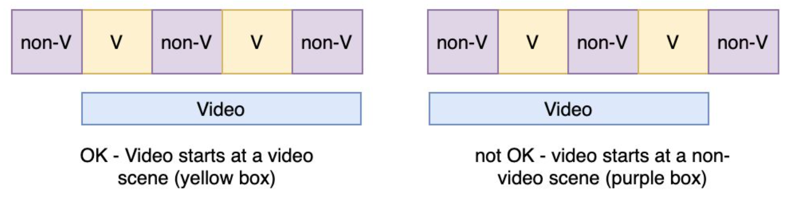

# Video Sequence Arrangement Algorithm

## <b>I. Overview</b>
Given a list of source videos, each with its duration **T**, and an ad sequence of length **N** with a fixed scene pattern (i.e. we know the positions of video & non-video scenes), this algorithm finds all possible positions of the source videos such that they must always start with a video scene (for more information, please take a look at [here](Pencil_AI_Task_v3.pdf)) - i.e. the video must start at the position of a video scene (yellow box):


## <b>II. Directory Structure</b>
 - `./data` : contains the sample data to test the algorithm. There are 2 text files in this folder:
    - `sequence_of_scenes.txt`: this file contains the sequence of scenes, in the form of `[T,F,T,F,F,T,T....]`
    - `video_list.txt`: this file contains the list of of the videos. Each row of this file describes a video by its name and length.
 - `./images` : contains the random images for this README file
 - `Pencil_AI_Task_v3.pdf`: this is the problem statement describing this task.
 - `video_sequence_arrangement.py`: this is the Python implementation of the algorithm, specifically the `foobar` function. This script also demonstrates the algorithm with the data in the `data` folder.
 - `test_video_sequence_arrangement.py`: : this is the unittest implementation of the algorithm.
 
 ## <b>II. Getting started</b>
 **_Step 1_** - To clone the repository, in your terminal, input this command line.
```terminal
git clone https://github.com/lochappy/video_sequence_arrangement.git
```
**_Step 2_** - To run the unittest, in your terminal, input this command line.
```terminal
python3 test_video_sequence_arrangement.py
```
**_Step 3_** - To run the demo, in your terminal, input this command line.
```terminal
python3 video_sequence_arrangement.py -s ./data/sequence_of_scenes.txt -v ./data/video_list.txt
```

## <b>III. Authors</b>
- Loc Truong <ttanloc@gmail.com>
